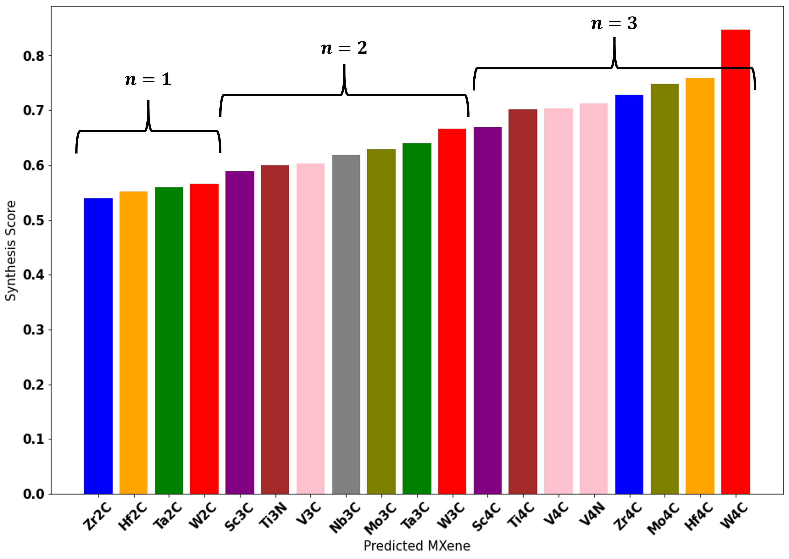
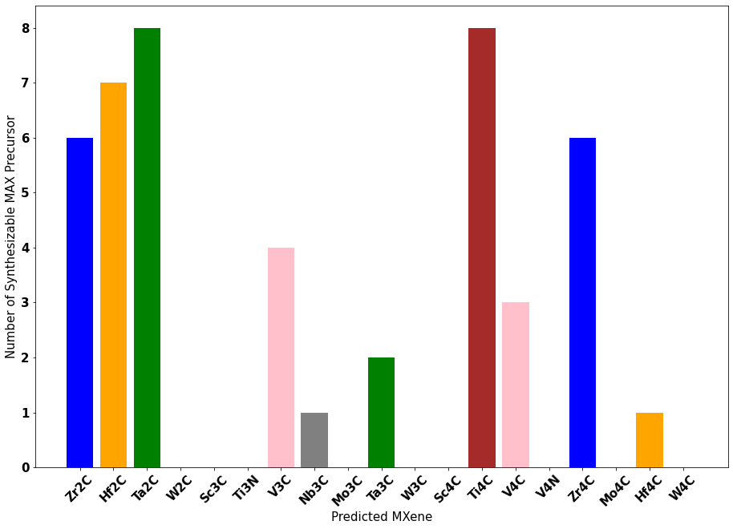

# PUMML_MXene_Synthesize
 

 ## Please note: This repository is currently non-functional due to a critical dependency on a now unmaintained and non-operational package. We are exploring alternatives and updates will be provided when available.
   
Prediction of Synthesis of 2D Metal Carbides and Nitrides (MXenes) and Their Precursors with Positive and Unlabeled Machine Learning.
This is a course project completed as part of my PhD program.

**New synthesizable MXene identified from this project:**
- $Zr_2C$ , $Hf_2C$, $Ta_2C$
- $Sc_3C_2$, $V_3C_2$, $Nb_3C_2$, $Mo_3C_2$, $Ta_3C_2$, $W_3C_2$
- $Sc_4C_3$, $Ti_4C_3$, $V_4C_3$, $V_4N_3$, $Zr_4C_3$, $Mo_4C_3$, $Hf_4C_3$, $W_4C_3$

## Abstract
This project uses open source dataset and positive and unlabelled machine learning technique to predict synthesizability of MXene and MAX precursor. Detailed hyperparameter tuning is carried out to generate a model with true positive rate greater than 0.9. The finalized model is then used to predict that 155 unlabelled MAX and 19 unlabelled MXene could be synthesized. Analysis of the model output suggests unique result regarding synthesizability of MXene that is not reported in literature. A further analysis to match MXene with respective precursor suggest that only 11 MXene could be synthesized due to the lack of synthesizable MAX precursor. Overall, this project could push forward the discovery of new generation of MXene, which would greatly expand material selection freedom for high performance applica- tions.

## Dataset
The dataset is obtained from pumml as cited below. Pumml is an open source Python library that performs positive and unlabeled material machine learning to classify materials when data is either incomplete or when examples of positive data is insufficient. Pumml offers a test dataset consisting of 66 entries of MXene phase and 792 entries of MAX phase. Only single M element is considered in order to reduce computational complexity. Of these entries, 10 entries of MXene and 63 entries of MAX phase are labeled positive (already successfully synthesized). Therefore, a fraction over 10 % of overall data are labelled positive, and the rest are unlabelled, making this pumml work a semi-supervised machine learning approach.

Pumml: Nathan C. Frey, Jin Wang, Gabriel Iván Vega Bellido, Babak Anasori, Yury Gogotsi, and Vivek B. Shenoy. Prediction of Synthesis of 2D Metal Carbides and Nitrides (MXenes) and Their Precursors with Positive and Unlabeled Machine Learning. ACS Nano 2019 13 (3), 3031-3041.

The dataset used for this project only consist of 4 features as shown below. These features represent four of the highest importance as confirmed by feature selection result from Frey et al. Using only the most important feature for model prediction can to some extent avoid over fitting as well as reduce computational time, which is highly desirable for this project.

- $n$: $M_{n+1}X_n$
- $a$: in-plane lattice constant
- $E_{form}$: formation energy
- $E_{coh}$: cohesive energy

## Model Pipeline
The sample space is represented by randomly distributed positively labelled data and unlabelled data. Some of the unlabelled samples are first randomly labelled as negative, a decision tree is then constructed based on these data to classify the remaining labelled sample as either positive (1) or negative (0). These process are repeated for *T* times where *T* is the number of bagging size. In each iteration a new set of sample are forced to be negatively labelled for the classifier. The synthesizability score of an unlabelled sample is calculated as the average of the predictive score from all the decision tree classifiers that do not contain that sample. A score of greater than 0.5 is labelled as positive and vise versa. The model is trained by *T* iterations and repeated *R* times with the data split into *k* number of folds. Upper limit for *k* value is the number of positively labelled entries in respective dataset. Hyperparameter tuning is performed based on these three parameters.

## Results

Synthesis score of synthesizable MXene arranged in ascending order is shown below. MXene with the same M element is labelled in the same color.

Synthesizable MXene arranged in the same order as above showing corresponding number of synthesizable MAX precursor.

 

